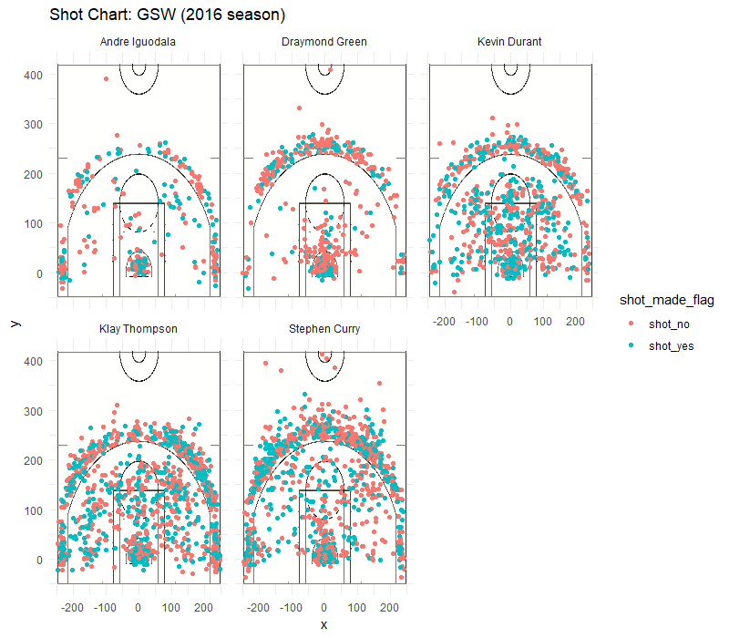

```{r}
#load the data
shots_data <- read.csv("../data/shots-data.csv", stringsAsFactors = FALSE)

#load the package
library('dplyr')

#creating  overall effective shooting percentage table
name <- c('Andre Iguodala','Draymond Green','Kevin Durant','Klay Thompson','Stephen Curry')
total_1 <- c(sum(shots_data$name =='Andre Iguodala'),
             sum(shots_data$name =='Draymond Green'),
             sum(shots_data$name =='Kevin Durant'),
             sum(shots_data$name =='Klay Thompson'),
             sum(shots_data$name =='Stephen Curry'))
made_1 <- c(sum(shots_data$name == 'Andre Iguodala' & shots_data$shot_made_flag == 'shot_yes'),
          sum(shots_data$name == 'Draymond Green' & shots_data$shot_made_flag == 'shot_yes'),
          sum(shots_data$name == 'Kevin Durant' & shots_data$shot_made_flag == 'shot_yes'),
          sum(shots_data$name == 'Klay Thompson' & shots_data$shot_made_flag == 'shot_yes'),
          sum(shots_data$name == 'Stephen Curry' & shots_data$shot_made_flag == 'shot_yes'))
perc_made_1 <- round(made_1/total_1*100,2)

overall_effective_shooting_percentage <- data.frame( name,total_1,made_1,perc_made_1)
names(overall_effective_shooting_percentage) <- c('name', 'total','made','perc_made')
overall_effective_shooting_percentage <- arrange(overall_effective_shooting_percentage, desc(perc_made))
overall_effective_shooting_percentage$perc_made <- paste(as.character(overall_effective_shooting_percentage$perc_made),'%',sep='')

#create 2PT field goal effective shooting percentage table
total_2 <- c(sum(shots_data$name =='Andre Iguodala'&shots_data$shot_type == '2PT Field Goal'),
             sum(shots_data$name =='Draymond Green'&shots_data$shot_type == '2PT Field Goal'),
             sum(shots_data$name =='Kevin Durant'&shots_data$shot_type == '2PT Field Goal'),
             sum(shots_data$name =='Klay Thompson' & shots_data$shot_type == '2PT Field Goal'),
             sum(shots_data$name =='Stephen Curry' & shots_data$shot_type == '2PT Field Goal'))

made_2 <- c(sum(shots_data$name == 'Andre Iguodala' & shots_data$shot_made_flag == 'shot_yes'&shots_data$shot_type == '2PT Field Goal'),
          sum(shots_data$name == 'Draymond Green' & shots_data$shot_made_flag == 'shot_yes'&shots_data$shot_type == '2PT Field Goal'),
          sum(shots_data$name == 'Kevin Durant' & shots_data$shot_made_flag == 'shot_yes'&shots_data$shot_type == '2PT Field Goal'),
          sum(shots_data$name == 'Klay Thompson' & shots_data$shot_made_flag == 'shot_yes'&shots_data$shot_type == '2PT Field Goal'),
          sum(shots_data$name == 'Stephen Curry' & shots_data$shot_made_flag == 'shot_yes'&shots_data$shot_type == '2PT Field Goal'))
perc_made_2 <- round(made_2/total_2*100,2)
PT2_effective_shooting_percentage <- data.frame( name,total_2,made_2,perc_made_2)
names(PT2_effective_shooting_percentage) <- c('name', 'total','made','perc_made')
PT2_effective_shooting_percentage <- arrange(PT2_effective_shooting_percentage, desc(perc_made))
PT2_effective_shooting_percentage$perc_made <- paste(as.character(PT2_effective_shooting_percentage$perc_made),'%',sep='')

#create 3PT field goal effective shooting percentage table
total_3 <- c(sum(shots_data$name =='Andre Iguodala'&shots_data$shot_type == '3PT Field Goal'),
             sum(shots_data$name =='Draymond Green'&shots_data$shot_type == '3PT Field Goal'),
             sum(shots_data$name =='Kevin Durant'&shots_data$shot_type == '3PT Field Goal'),
             sum(shots_data$name =='Klay Thompson' & shots_data$shot_type == '3PT Field Goal'),
             sum(shots_data$name =='Stephen Curry' & shots_data$shot_type == '3PT Field Goal'))

made_3 <- c(sum(shots_data$name == 'Andre Iguodala' & shots_data$shot_made_flag == 'shot_yes'&shots_data$shot_type == '3PT Field Goal'),
          sum(shots_data$name == 'Draymond Green' & shots_data$shot_made_flag == 'shot_yes'&shots_data$shot_type == '3PT Field Goal'),
          sum(shots_data$name == 'Kevin Durant' & shots_data$shot_made_flag == 'shot_yes'&shots_data$shot_type == '3PT Field Goal'),
          sum(shots_data$name == 'Klay Thompson' & shots_data$shot_made_flag == 'shot_yes'&shots_data$shot_type == '3PT Field Goal'),
          sum(shots_data$name == 'Stephen Curry' & shots_data$shot_made_flag == 'shot_yes'&shots_data$shot_type == '3PT Field Goal'))
perc_made_3 <- round(made_3/total_3*100,2)
PT3_effective_shooting_percentage <- data.frame( name,total_3,made_3,perc_made_3)
names(PT3_effective_shooting_percentage) <- c('name', 'total','made','perc_made')
PT3_effective_shooting_percentage <- arrange(PT3_effective_shooting_percentage, desc(perc_made))
PT3_effective_shooting_percentage$perc_made <- paste(as.character(PT3_effective_shooting_percentage$perc_made),'%',sep='')
```

***
##Who is the real 'killer' of the Warriors?

```{r out.width='80%', echo=FALSE, fig.align='center'}
knitr::include_graphics('../../../gsw.jpg')
```


The Golden State Warriors has a group of gifted offensive players: Andre Iguodala, Draymond Green, Kevin Durant, Klay Thompson and Stephen Curry. They won NBA champions for Warriors and made it perhaps the greatest team of all time. Among them, who do you think is the real 'killer' of the Warriors?  What is your answer? Curry? Clay? or Durant? Today, let's see through the following shooting stat to analyse who is the real 'killer' of the Warriors?

```{r out.width='80%', echo=FALSE, fig.align='center'}

```

###Overall Effective Shooting Percentage
```{r echo=FALSE}
overall_effective_shooting_percentage
```

###2PT Effective Shooting Percentage
```{r echo=FALSE}
PT2_effective_shooting_percentage
```

###3PT Effective Shooting Percentage
```{r echo=FALSE}
PT3_effective_shooting_percentage
```
###NO.5 Andre Iguodala

```{r out.width='80%', echo=FALSE, fig.align='center'}
knitr::include_graphics('../../../iguodala.jpg')
```

Many fans get surprised by this result since Iguodala¡¯ s 2PT shooting accuracy is surprising 63.81% and ranks at the top. His overall effective shooting accuracy reaches to 51.75% and ranks at the second. But due to the problem of his age, his playing time is limited, so the total amount of shots he made during the season is the least of the five players. His 3 pointer shooting accuracy, 36.02%, is not good, either. What¡¯s more, we can see clearly from the shot chart, Iguodala has some hot shooting area, which includes the key area and the fourty-five degree and bottom angle on both sides. In other words, he also has some cold shooting area, indicating that he may not make shots from these places as well as other areas. Thus, we think Andre Iguodala rank fifth among them.

###NO.4 Draymond Green
```{r out.width='80%', echo=FALSE, fig.align='center'}
knitr::include_graphics('../../../green.jpg')
```

Seeing from the table, we can get a conclusion that Green is relatively bad at shooting among these five players. He ranks at the last in terms of no matter overall, 2PT or 3PT effective shooting accuracy. His three pointers shooting accuracy is poorly 31.9%. Like Andre Iguodala, he has some cold shooting area£¬such as the both sides of the court. But what we should notice is that, although the ranks of his overall and 2PT shooting accuracy are not high, they are approximate 40% and 50%, which is not bad. And it is understandable for a inside player to have a low 3PT shooting accuracy. What¡¯s more, Draymond Green is not famous for his shooting skills, instead he is very good at defending and organizing the offence of the team. He made a lot of contribution to the team besides just scoring. Of course, it would be much better if he could improve his shootings skills, which will make him and the team more competitive. Taking all of this into consideration, Draymond Green is regarded to rank fourth among them.

###No.3 Clay Thompson
```{r out.width='80%', echo=FALSE, fig.align='center'}
knitr::include_graphics('../../../thompson.jpg')
```

I believe most of the fans has guessed out this result. As a great shooter of all time, he didn¡¯t make fans disappointed. His 2PT and 3PT shooting accuracy are well above 50% and 40%, which is considered to be the symbol of a top shooters. As a result , his overall effective shooting accuracy is almost 48%, ranking at the third place. What¡¯s more, the total shots and the total 3 pointers he made is only second to Stephen Curry. Unlike Andre Iguodala and Draymond Green, he has no so called cold shooting area. He can make shots from every place of the court, and he is good at all kinds of skills of shooting, such as catch and shoot, turn around jumper and attack the rim directly. This is what make him rank third and why many fans love him.

###No.2 Stephen Curry
```{r out.width='80%', echo=FALSE, fig.align='center'}
knitr::include_graphics('../../../curry.jpg')
```

Another great shooter, perhaps the best shooter of all time, Curry had amazing performance this season. He made 280 3 pointers, which is the most among the whole NBA league. To people¡¯s surprise, he can keep the 3PT shooting accuracy above 40% while making so many 3 pointers. What¡¯s more he is good at 2PT, too. He made 304 2PT with an accuracy of 54%. Also, seen from the shot chart, he can shoot from every place of the court, even from the logo! Do you still remember the game winning ball he made from the place near the half court line when Warriors is against Thunder? Besides, most of the shots he made are stop jump shots after quick handling, which implies great difficulty. Based on the discussion above, we think Curry should rank at the second place. 


###No.1 Kevin Durant
```{r out.width='80%', echo=FALSE, fig.align='center'}
knitr::include_graphics('../../../durant.jpg')
```

Now let¡¯s announce the No.1 player. Of course, he is Kevin Durant. Some basketball fans may get surprised by this result before reading this article, since when talking about good shooters of Warriors, the first two that come into people's mind are usually Curry and Thompson. Seen from the table, Durant has a very good shooting accuracy. Durant's overall effective shooting accuracy is above 54%, ranking top. And he ranks second in the 2PT shooting accuracy and third in the 3PT shooting accuracy. What¡¯s more, he made almost 500 shots with only 915 tries, which will is much less than that of Curry and Thompson. Most of his offence can be converted to score. Besides, from the shot chart, we can see that Durant can make shots from nearly anywhere of the court. He is good at all kinds of offensive skills as well, such as dunking, stop jumper, turn around jumper and so on. He is a very efficient and comprehensive attacker and this is why he ranks No.1.  

So far we rand these five players based on the analysis about the shooting accuracy and shot chart. In a nut shell, Kevin Durant and Stephen Curry rank the top two because of their comprehensive offensive skills but Durant is a little bit more efficient. Clay Thompson ranks at the third place due to his good shooting skills. Andre Iguodala and Draymond Green rank at the last two places because of total amount of shots made and shooting accuracy problem. Do you agree with the discussion above? What¡¯s your opinion?


####Refercences:

Data: [https://github.com/ucb-stat133/stat133-hws/tree/master/data](https://github.com/ucb-stat133/stat133-hws/tree/master/data)

Picture:

Kevin Durant:
[https://www.google.com/search?q=kevin+durant&hl=zh-CN&authuser=0&source=lnms&tbm=isch&sa=X&sqi=2&ved=0ahUKEwjHkqj9wYDhAhWMwcQBHTZbCzwQ_AUIDigB&biw=766&bih=712#imgrc=vHl_HtVg8GznaM:](https://www.google.com/search?q=kevin+durant&hl=zh-CN&authuser=0&source=lnms&tbm=isch&sa=X&sqi=2&ved=0ahUKEwjHkqj9wYDhAhWMwcQBHTZbCzwQ_AUIDigB&biw=766&bih=712#imgrc=vHl_HtVg8GznaM:)

Stephen Curry:
[https://www.google.com/search?hl=zh-CN&authuser=0&biw=766&bih=663&tbm=isch&sa=1&ei=B7OJXP7_MI31-wSZkIKgBQ&q=stephen+curry&oq=stephen&gs_l=img.1.0.0l8j0i12l2.37235.40168..41438...3.0..1.160.681.9j1......2....1..gws-wiz-img.....0..0i19._NXZ-UzACQI#imgrc=DWwO_Vwvt-zpUM:](https://www.google.com/search?hl=zh-CN&authuser=0&biw=766&bih=663&tbm=isch&sa=1&ei=B7OJXP7_MI31-wSZkIKgBQ&q=stephen+curry&oq=stephen&gs_l=img.1.0.0l8j0i12l2.37235.40168..41438...3.0..1.160.681.9j1......2....1..gws-wiz-img.....0..0i19._NXZ-UzACQI#imgrc=DWwO_Vwvt-zpUM:)

Dramond Green:
[https://www.google.com/search?hl=zh-CN&authuser=0&biw=766&bih=663&tbm=isch&sa=1&ei=MrOJXPbRGMy4-gT75bvICA&q=draymond+green&oq=Draymon&gs_l=img.1.0.0l7.21998.26070..27747...3.0..0.80.558.10......1....1..gws-wiz-img.......0i19.HIL3uHBEHjM#imgrc=MDyb_mWnLXfiEM:](https://www.google.com/search?hl=zh-CN&authuser=0&biw=766&bih=663&tbm=isch&sa=1&ei=MrOJXPbRGMy4-gT75bvICA&q=draymond+green&oq=Draymon&gs_l=img.1.0.0l7.21998.26070..27747...3.0..0.80.558.10......1....1..gws-wiz-img.......0i19.HIL3uHBEHjM#imgrc=MDyb_mWnLXfiEM:)

Clay Thompson:
[https://www.google.com/search?hl=zh-CN&authuser=0&biw=766&bih=663&tbm=isch&sa=1&ei=T7OJXAyF1foEzdSXsAs&q=klay+thompson&oq=klay&gs_l=img.1.0.0l10.41162.43766..45445...3.0..0.66.376.7......1....1..gws-wiz-img.......35i39.CqQBYfb3HRM#imgrc=xWPzkcJ-d06CwM:](https://www.google.com/search?hl=zh-CN&authuser=0&biw=766&bih=663&tbm=isch&sa=1&ei=T7OJXAyF1foEzdSXsAs&q=klay+thompson&oq=klay&gs_l=img.1.0.0l10.41162.43766..45445...3.0..0.66.376.7......1....1..gws-wiz-img.......35i39.CqQBYfb3HRM#imgrc=xWPzkcJ-d06CwM:)

Andre Iguodala:
[https://www.google.com/search?hl=zh-CN&authuser=0&biw=766&bih=663&tbm=isch&sa=1&ei=fbOJXIqUEcr4-wSU_rmwAQ&q=iguodala&oq=iguo&gs_l=img.1.0.0l3j0i30l7.47878.48240..50043...0.0..0.150.304.3j1......1....1..gws-wiz-img.nm4z7-Nuq6c#imgrc=iR8opzJPxt5UKM:](https://www.google.com/search?hl=zh-CN&authuser=0&biw=766&bih=663&tbm=isch&sa=1&ei=fbOJXIqUEcr4-wSU_rmwAQ&q=iguodala&oq=iguo&gs_l=img.1.0.0l3j0i30l7.47878.48240..50043...0.0..0.150.304.3j1......1....1..gws-wiz-img.nm4z7-Nuq6c#imgrc=iR8opzJPxt5UKM:)

GSW(the picture containing five players):
[https://image.baidu.com/search/detail?ct=503316480&z=0&ipn=d&word=%E5%8B%87%E5%A3%AB16%E5%B9%B4%E6%AD%BB%E4%BA%A1%E4%BA%94%E5%B0%8F&step_word=&hs=0&pn=7&spn=0&di=14936133960&pi=0&rn=1&tn=baiduimagedetail&is=0%2C0&istype=0&ie=utf-8&oe=utf-8&in=&cl=2&lm=-1&st=undefined&cs=2795259416%2C3036709278&os=342926805%2C319308361&simid=0%2C0&adpicid=0&lpn=0&ln=1354&fr=&fmq=1552528492853_R&fm=&ic=undefined&s=undefined&hd=undefined&latest=undefined&copyright=undefined&se=&sme=&tab=0&width=undefined&height=undefined&face=undefined&ist=&jit=&cg=&bdtype=0&oriquery=&objurl=http%3A%2F%2F03.imgmini.eastday.com%2Fmobile%2F20180511%2F20180511015823_d53d8bf466a6c706cd703dffb8a719d3_1.jpeg&fromurl=ippr_z2C%24qAzdH3FAzdH3Ffr56pf_z%26e3Bjwfp1wy_z%26e3Bv54AzdH3FwAzdH3F8bac88a8cbdncclaaaaaa_z%26e3Bip4s&gsm=0&rpstart=0&rpnum=0&islist=&querylist=&force=undefined](https://image.baidu.com/search/detail?ct=503316480&z=0&ipn=d&word=%E5%8B%87%E5%A3%AB16%E5%B9%B4%E6%AD%BB%E4%BA%A1%E4%BA%94%E5%B0%8F&step_word=&hs=0&pn=7&spn=0&di=14936133960&pi=0&rn=1&tn=baiduimagedetail&is=0%2C0&istype=0&ie=utf-8&oe=utf-8&in=&cl=2&lm=-1&st=undefined&cs=2795259416%2C3036709278&os=342926805%2C319308361&simid=0%2C0&adpicid=0&lpn=0&ln=1354&fr=&fmq=1552528492853_R&fm=&ic=undefined&s=undefined&hd=undefined&latest=undefined&copyright=undefined&se=&sme=&tab=0&width=undefined&height=undefined&face=undefined&ist=&jit=&cg=&bdtype=0&oriquery=&objurl=http%3A%2F%2F03.imgmini.eastday.com%2Fmobile%2F20180511%2F20180511015823_d53d8bf466a6c706cd703dffb8a719d3_1.jpeg&fromurl=ippr_z2C%24qAzdH3FAzdH3Ffr56pf_z%26e3Bjwfp1wy_z%26e3Bv54AzdH3FwAzdH3F8bac88a8cbdncclaaaaaa_z%26e3Bip4s&gsm=0&rpstart=0&rpnum=0&islist=&querylist=&force=undefined)
